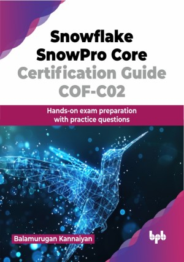

# Snowflake SnowPro Core Certification Guide COF-C02

Hands-on exam preparation with practice questions.

This is the repository for [Snowflake SnowPro Core Certification Guide COF-C02
](https://bpbonline.com/products/snowflake-snowpro-core-certification-guide-cof-c02?variant=44068000301256),published by BPB Publications.

## About the Book
Snowflake, a revolutionary cloud data warehouse platform, has gained immense popularity due to its scalability, performance, and ease of use. This comprehensive guide is designed with the knowledge and skills necessary to pass the SnowPro Core Certification exam and excel in the world of Snowflake.

Prepare for the SnowPro Core Certification with this all-inclusive guide. Understand Snowflake’s architecture, data types, and security features while mastering virtual warehouse management. Learn essential data movement strategies and performance optimization techniques like caching and clustering, and explore the latest Snowflake features. This guide includes mock tests and expert advice to help you confidently tackle the certification exam. You will gain a solid understanding of Snowflake’s unique strengths, including its ability to manage both structured and semi-structured data, secure information, and optimize performance for complex tasks.

By the end of this book, you will be well-prepared to tackle the SnowPro Core Certification exam with confidence. You will have a solid grasp of Snowflake's fundamentals, be able to write efficient SQL queries, optimize performance, and implement best practices for data security and governance.

## What You Will Learn
• SnowPro Core Certification overview, including subject area/domain breakdown. 

• Essential tips to prepare and pass the exam.

• Snowflake’s fundamentals to advanced key concepts outlined in the SnowPro Certification.

• Industry best practices and recommendations on various key concepts.

• SnowPro Core Certification sample practice questions to test the overall knowledge.
